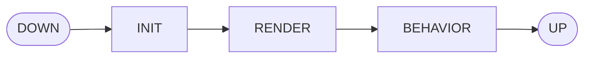

# Jellycat Component

## Installation
```console
$ npm i -S jellycat-component
```

## Getting started

Minimal naked component look like this :

> Sample.js
```js
import { JcComponent } from 'jellycat-component'

export default class Sample extends JcComponent
{
  constructor() { super() }

  init()
  {
    // code here..
  }

  render()
  {
    // code here..
  }

  behavior()
  {
    // code here..
  }

}
```

> index.html
```html
<jc-sample></jc-sample>

<script type='text/javascript'>
  import Sample from './Sample.js'
  Sample.define()
</script>
```

## Extends from HTML ancestors

If you prefere keep html default tagname, Jellycat Component let you use the "**is**" attribute.
HTML tagnames supported are : `div`, `span`, `ul`, `li`, `p`, `label`, `input`, `textarea`.
to use this feature yo have to extend your component from one of this class in place of JcComponent :

- JcDivComponent
- JcSpanComponent
- JcUlComponent
- JcLiComponent
- JcPComponent
- JcLabelComponent
- JcInputComponent
- JcTextareaComponent

### Example

> Sample.js
```js
import { JcDivComponent } from 'jellycat-component'
export default class Sample extends JcDivComponent { ... }
````

> index.html
```html
<div is="jc-sample"></div>

<script type='text/javascript'>
  import Sample from './Sample.js'
  Sample.define()
</script>
````

## Lifecycle

Jellycat components have lifecycle, start to `down` and go to `up`, each state perform different actions. You have to use this three lifecycle to develop your component : `init`, `render`, `behavior`. refere to API References - lifecycle to have more informations about each lifecycle.



## Templating

Jellycat Component come with template engine that you can use to manage html of your component
make and html file with some template inside :

> Sample.html
```html
<template id="root">
  <div class="container"></div>
</template>

<template id="custom">
  <p>Hello World !</p>
</template>
````

this file need to be expose on web and accesable from a static url like assets, see more information in API - Reference - Integration.
you can attach this file to your component like that :

> index.html
```html
<jc-sample></js-sample>

<script type='text/javascript'>
  import Sample from './Sample.js'
  Sample.define('templates/Sample.html')
</script>
````

by default the template with id "**root**" will be use as root html for your component but if your prefere set custom id you can use "*template*" attribute on component to specify id manualely.

> index.html
```html
<jc-sample template="custom"></js-sample>
````

all templates element in file will be passed to define method will be accesable with drawTemplate method since the render lyfecycle of the component.

> Sample.js
```js
export default class Sample extends JcComponent
{
  render()
  {
    let template = this.drawTemplate('custom')
    this.querySelector('.container').appendChild(template)
  }
}
````

## Providing data

Jellycat Component can perform HTTP request to load data or use some api or backend

> Sample.js
```js
export default class Sample extends JcComponent
{
  init()
  {
    let data = this.fetchData('GET', url)
  }
}
````

## Jellycat Options

Jellycat Options can be used on 3 level of effect, if you defined option on instance of component, it was scoped to component, if you define on component is scope tout all instance of this component and if you define on Jellycat global var it will be apply to all of component.

available options are :
- **debug** *boolean* `default: **false**`
- **prefix** *string* `default: **jc**`
- **autoRender** *string* `default: **root**`

> index.html
```html
<jc-sample></js-sample>

<script type='text/javascript'>
  import Sample from './Sample.js'
  Jellycat.options({ debug: true })
  Sample.define('templates/Sample.html')
</script>
````

> index.html
```html
<jc-sample></js-sample>

<script type='text/javascript'>
  import Sample from './Sample.js'
  Sample.define('templates/Sample.html', { debug: true })
</script>
````

> index.html
```html
<jc-sample options="<!-- optionsJson -->"></js-sample>
````

## API References

### component
- JcComponent
- JcDivComponent
- JcSpanComponent
- JcUlComponent
- JcLiComponent
- JcPComponent
- JcLabelComponent
- JcInputComponent
- JcTextareaComponent
- Static method define()

### lifecycle

- Async method init()
- Async method render()
- Async method behavior()
- Method currentLifeCycleIndex()

### templating:
- Property template
- Method draw
- Method drawElement

### providing:
- Property loading
- Async method fetchData

### options:
- Property options

### Mycelaneous:
- Method methods
- Method drawFaIcon
