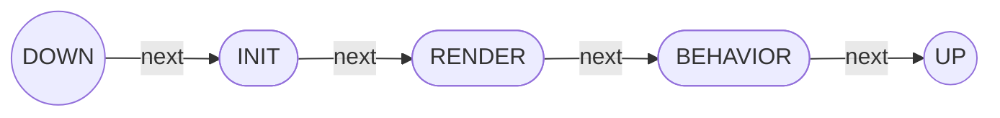

# Jellycat Component

## Installation
```console
user@121: ~$ npm i -S jellycat-component
```

## Getting started

Sample.js
```js
import { JcComponent } from 'jellycat-component'

export default class Sample extends JcComponent
{
  constructor() { super() }

  init()
  {
    // code here..
  }

  render()
  {
    // code here..
  }

  behavior()
  {
    // code here..
  }

}
````

index.js
```js
import Sample from './Sample.js'
// ...
Sample.define()
````

index.html
```html
<jc-sample></jc-sample>
````


## API References

### component
- JcComponent
- JcDivComponent
- JcSpanComponent
- JcUlComponent
- JcLiComponent
- JcPComponent
- JcLabelComponent
- JcInputComponent
- JcTextareaComponent
- Static method define()

### lifecycle



- Async method init()
- Async method render()
- Async method behavior()
- Method currentLifeCycleIndex()

### templating:
- Property template
- Method draw
- Method drawElement

### providing:
- Property loading
- Async method fetchData

### options:
- Property options

### Mycelaneous:
- Method methods
- Method drawFaIcon
